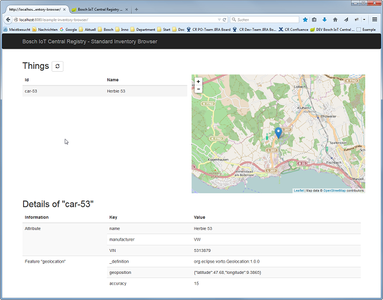

# Bosch IoT Central Registry - Example Inventory Browser

This example shows how to create a simple user interface to list things and their details and show the things on a map.

**Notice:** Currently this demo uses a workaround for the representation of Features of Things.
As soon as the CR supports updating feature properties using the CR-Integration Client for Java this can be changed.



# Build

Use the following maven command to build the server:
```
mvn clean install
```

# Configure your API Key and other settings

Create or adjust file "config.properties"

```
centralRegistryTargetHost=https://cr.apps.bosch-iot-cloud.com
centralRegistryApiToken=### your CR Solution API Token ###
http.proxyHost=### your http proxy host, if you need one ###
http.proxyPort=### your http proxy port, if you need one ###
```

# Run Server

Use the following command to run the server.
```
java -jar target/inventory-browser.jar
```

# Usage

## Show Dashboard

Browse to the Bosch IoT Central Registry Dashboard: <https://cr.apps.bosch-iot-cloud.com/>

## Create a Solution

Use the dashboard to create a solution.

## Create Demo User

Use the dashboard to create a demo user.

## Show Inventory Browser

Browse to the example web app: <http://localhost:8080/inventory-browser/>

## Create Empty Thing

In REST Documentation (Swagger): <https://cr.apps.bosch-iot-cloud.com/doc/>
use "Things - POST /things"

thing:
```
{}
```

Look in the response for the created Thing. Within this you will find your user's unique id which can be used in the next steps.

## Create Thing for Herbie

Use "Things - PUT /things"
thingId: demo:vehicle-53

thing:

_Change the ids before executing this call._
```
{
  "acl": {
    "### id of your user ###":             { "READ": true, "WRITE": true, "ADMINISTRATE": true },
    "### id of your solution ###:gateway": { "READ": true, "WRITE": true, "ADMINISTRATE": false }
  },
  "attributes": {
      "name":         "Herbie 53",
      "manufacturer": "VW",
      "VIN":          "5313879",

      "_features": {
        "geolocation": {
          "properties": {
            "_definition": "org.eclipse.vorto.Geolocation:1.0.0",
            "geoposition": {
              "latitude":   47.68,
              "longitude":  9.3865
            },
            "accuracy": 15
          }
        }
     }
  }
}
```

# Refresh Things in Inventory Browser

# Update Position of Herbie

Use "Features - PUT /things/{thingId}/features/{featureId}/properties/{propertyPath}"

thingId: demo:vehicle-53

featureId: geolocation

propertyPath: _features/geolocation/properties/geoposition/latitude
```
47.665
```

propertyPath: _features/geolocation/properties/geoposition
```
{
  "latitude": 47.68,
  "longitude": 9.3865
}
```

# Refresh Things in Inventory Browser

# More example Things

See [testdata.json](testdata.json) for more example things to create.
